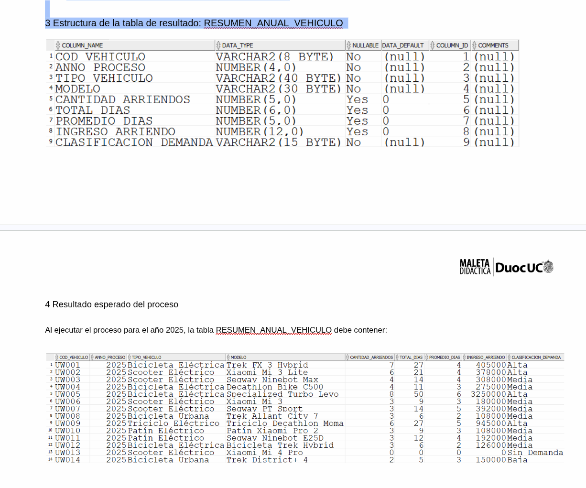

Caso Arriendo de Vehículos de Movilidad Urbana — URBAN WHEELS LTDA.

URBAN WHEELS LTDA. es una empresa con sede en Santiago, fundada en 2012, dedicada al arriendo de vehículos de movilidad urbana eléctrica: bicicletas eléctricas, scooters, patines eléctricos, bicicletas urbanas y triciclos, de marcas como Trek, Specialized, Xiaomi, Segway y Decathlon. Cada vehículo está asignado a un encargado de arriendo que gestiona la reserva, entrega, devolución e inspección de la unidad.
La empresa contrató a SIIT (donde usted trabaja) para desarrollar herramientas analíticas que apoyen la toma de decisiones. En esta etapa se debe construir el proceso de análisis anual de demanda por vehículo y, a partir de él, una propuesta automatizada de ajuste de tarifas para la revisión de enero de cada año.
Para las pruebas se utilizará el historial de arriendos del año 2025 (año completo).

1 Reglas del negocio (Resumen anual de demanda)

Para cada vehículo eléctrico de la flota se debe calcular, considerando únicamente los arriendos del año de proceso (2025), la siguiente información de gestión:
Cantidad de arriendos: número total de arriendos del vehículo en el año (función de grupo COUNT).
Total de días arrendados: suma de los días solicitados de todos los arriendos del año (función de grupo SUM).
Promedio de días por arriendo: total de días dividido por la cantidad de arriendos, redondeado a entero (0 si no hubo arriendos).
Ingreso por arriendo: valor de arriendo diario del vehículo multiplicado por el total de días arrendados en el año.
Clasificación de demanda: categoría asignada según la cantidad de arriendos del año, de acuerdo con la siguiente tabla:

Cantidad de arriendos en el año
Clasificación de demanda
6 o más
Alta
3 a 5
Media
1 a 2
Baja
0 (sin arriendos)
Sin Demanda

2 Requerimientos mínimos de diseño

La simulación del proceso debe implementarse mediante un bloque PL/SQL anónimo, considerando lo siguiente:
2.1 Información que debe generar el proceso
El resultado debe quedar almacenado en la tabla RESUMEN_ANUAL_VEHICULO.
2.2 Consideraciones para la construcción del proceso
Se debe TRUNCAR la tabla RESUMEN_ANUAL_VEHICULO en tiempo de ejecución, para poder ejecutar el bloque las veces que se requiera.
Debe utilizarse un cursor explícito SIN parámetros que recorra los vehículos de la flota (VEHICULO_ELECTRICO).
Todos los cálculos deben redondearse a valores enteros.
La información debe almacenarse ordenada por el código del vehículo.
El proceso debe considerar los arriendos del año 2025.
2.3 Eficiencia (obligatorio)
El SELECT del cursor SIN parámetro debe obtener SÓLO los datos básicos del vehículo (código, modelo, tipo y valor de arriendo).
Los valores que requieran funciones de grupo (CONTAR y SUMAR) deben obtenerse en sentencias SELECT por separado.
La clasificación de demanda debe determinarse en PL/SQL mediante estructuras de control (IF/CASE).
TODOS los cálculos deben efectuarse en sentencias PL/SQL.

3 Estructura de la tabla de resultado: RESUMEN_ANUAL_VEHICULO
