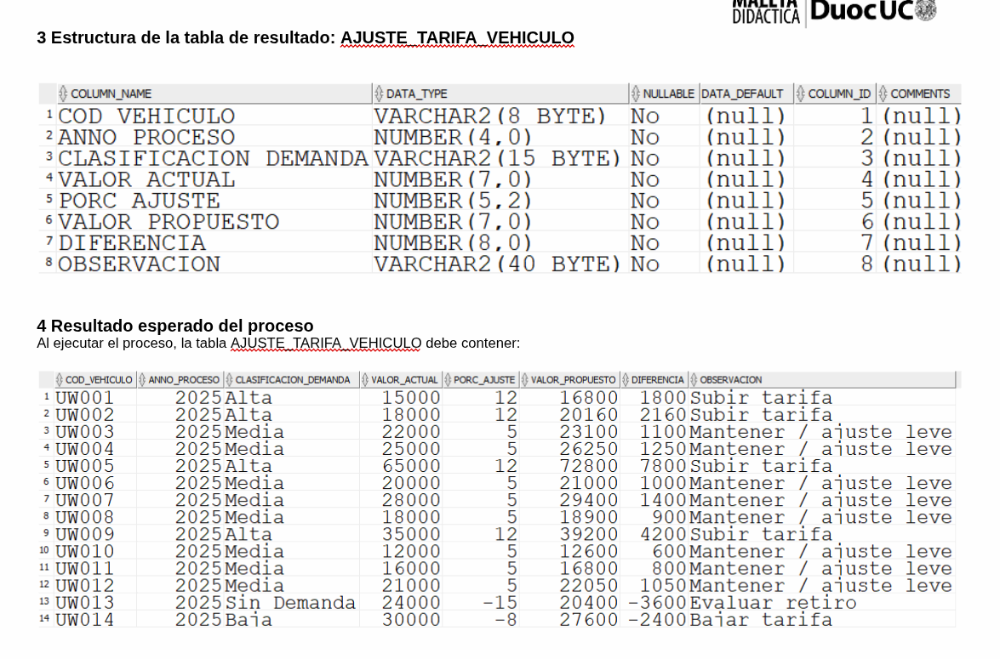

Caso Arriendo de Vehículos de Movilidad Urbana — URBAN WHEELS LTDA.

URBAN WHEELS LTDA. es una empresa con sede en Santiago, fundada en 2012, dedicada al arriendo de vehículos de movilidad urbana eléctrica: bicicletas eléctricas, scooters, patines eléctricos, bicicletas urbanas y triciclos, de marcas como Trek, Specialized, Xiaomi, Segway y Decathlon. Cada vehículo está asignado a un encargado de arriendo que gestiona la reserva, entrega, devolución e inspección de la unidad.
La empresa contrató a SIIT (donde usted trabaja) para desarrollar herramientas analíticas que apoyen la toma de decisiones. En esta etapa se debe construir el proceso de análisis anual de demanda por vehículo y, a partir de él, una propuesta automatizada de ajuste de tarifas para la revisión de enero de cada año.
URBAN WHEELS LTDA., con sede en Santiago, arrienda vehículos de movilidad urbana eléctrica. Para la revisión de tarifas de enero, la empresa ajusta el valor de arriendo de cada vehículo según la demanda que tuvo durante el año anterior.

1 Reglas del negocio (Propuesta de ajuste de tarifas)

Para cada vehículo de la flota se debe determinar su clasificación de demanda según la cantidad de arriendos del año 2025 y, a partir de ella, proponer un nuevo valor de arriendo:
Cantidad de arriendos en 2025
Clasificación de demanda
6 o más
Alta
3 a 5
Media
1 a 2
Baja
0 (sin arriendos)
Sin Demanda

Según la clasificación se obtiene el porcentaje de ajuste de la tabla PARAM_AJUSTE_DEMANDA:
Alta +12 %, 
Media +5 %,
Baja −8 %,
Sin Demanda −15 %
Luego: valor propuesto = valor actual × (1 + % / 100), redondeado.
Diferencia = valor propuesto − valor actual.
Observación según la clasificación (Subir tarifa, Mantener / ajuste leve, Bajar tarifa o Evaluar retiro).
Clasificación de demanda
OBSERVACIÓN
Alta
Subir tarifa
Media
Mantener / ajuste leve
Baja
Bajar tarifa
Sin Demanda
Evaluar retiro

2 Requerimientos mínimos de diseño
2.1 Información que debe generar el proceso
El resultado debe quedar almacenado en la tabla AJUSTE_TARIFA_VEHICULO.
2.2 Consideraciones para la construcción del proceso
Se debe TRUNCAR la tabla AJUSTE_TARIFA_VEHICULO en tiempo de ejecución.
Debe utilizarse un cursor explícito SIN parámetros que recorra los vehículos de la flota (VEHICULO_ELECTRICO).
Todos los cálculos deben redondearse a valores enteros.
La información debe almacenarse ordenada por el código del vehículo.
2.3 Eficiencia (obligatorio)
La cantidad de arriendos del año 2025 de cada vehículo debe obtenerse con una función de grupo (COUNT) en una sentencia SELECT por separado.
La clasificación de demanda debe determinarse en PL/SQL mediante estructuras de control (IF/CASE).
El porcentaje de ajuste debe obtenerse desde la tabla PARAM_AJUSTE_DEMANDA en una sentencia SELECT por separado.
El SELECT del cursor SIN parámetro debe obtener SÓLO los datos básicos del vehículo (código y valor de arriendo diario).
TODOS los cálculos deben efectuarse en sentencias PL/SQL.
